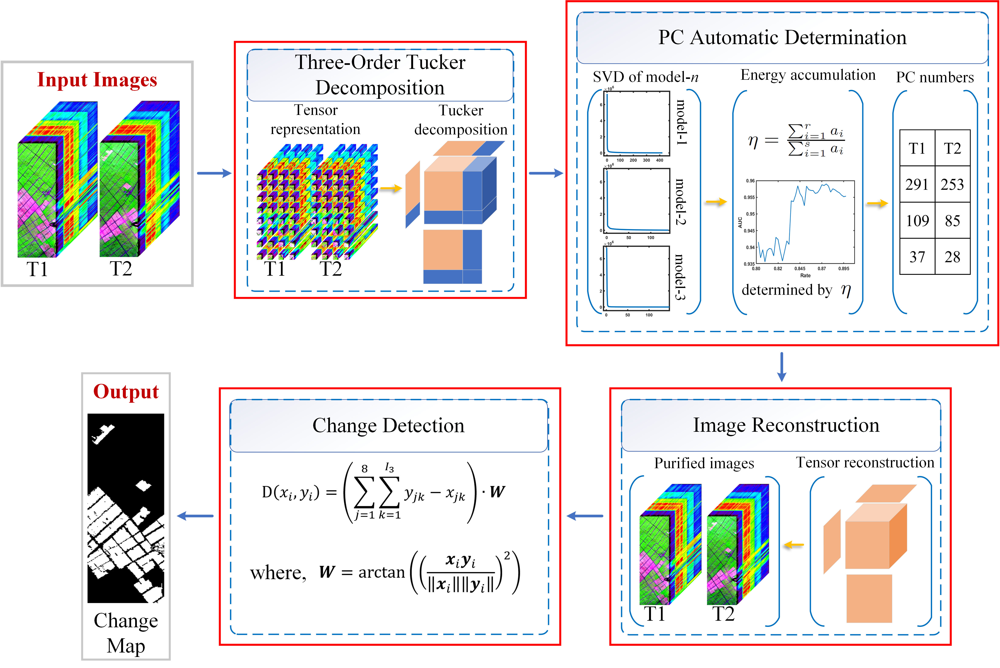

# Hyperspectyral-Change-Detection-TDRD
Three-Order Tucker Decomposition and Reconstruction Detector for Unsupervised Hyperspectral Change Detection

# Source
Paper Download:
- [https://ieeexplore.ieee.org/document/9451632](https://ieeexplore.ieee.org/document/9451632)

Hermiston dataset:
- [Google Drive](https://drive.google.com/file/d/1-UqfGNsWXY3UnCjyG1WaDOxietuwF2XG/view?usp=sharing)
- [Baidu Disk, Extraction code: 6c2e](https://pan.baidu.com/s/1u7gHjKtIGZXH3ykCX9APxw)

# Citation
If these codes and dataset are helpful for you, please cite this paper:

BibTex Format:
@ARTICLE{9451632,  author={Hou, Zengfu and Li, Wei and Tao, Ran and Du, Qian},  journal={IEEE Journal of Selected Topics in Applied Earth Observations and Remote Sensing},   title={Three-Order Tucker Decomposition and Reconstruction Detector for Unsupervised Hyperspectral Change Detection},   year={2021},  volume={14},  number={},  pages={6194-6205},  doi={10.1109/JSTARS.2021.3088438}}

Plain Text Format:
Z. Hou, W. Li, R. Tao and Q. Du, "Three-Order Tucker Decomposition and Reconstruction Detector for Unsupervised Hyperspectral Change Detection," in IEEE Journal of Selected Topics in Applied Earth Observations and Remote Sensing, vol. 14, pp. 6194-6205, 2021, doi: 10.1109/JSTARS.2021.3088438.

# My Website
- [Github Website](https://zephyrhours.github.io/)
- [Chinese CSDN](https://blog.csdn.net/NBDwo)
